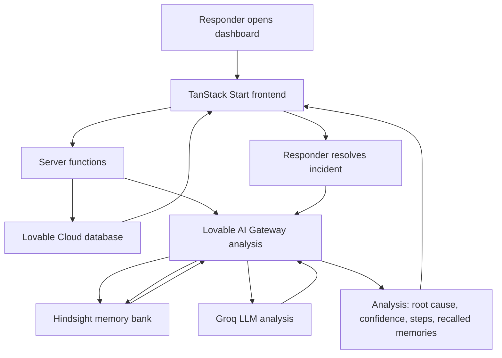

<div align="center">

# IncidentIQ

**An incident-response dashboard that learns from every outage it sees.**


[Live Dashboard](https://incident-insights-90.lovable.app) · [Backend Source](https://github.com/astacatalyst/Incident-Response-Agent)

</div>

---

## What it is

IncidentIQ is a full-stack incident-response agent. When a new incident comes in, it recalls similar past incidents from a memory bank, analyzes the situation with an LLM, and proposes a root cause, confidence score, and concrete resolution steps. When the incident is resolved, the fix is written back to memory — so the agent gets smarter with every outage.

This repository contains the **polished dashboard frontend**, backed by **Lovable Cloud** for incident data and a **FastAPI backend** for AI analysis and memory.

## Features

- **Overview dashboard** — live stats, recurring root-cause chart, memory-bank health, recent lessons learned
- **Incident list** — 25 real public postmortems (AWS S3 2017, Meta BGP 2021, CrowdStrike 2024, GitLab 2017, and more), filterable by service, severity, and status
- **Before / After comparison** — replays a real past incident twice, with and without memory, and scores the difference out of 100
- **Memory recall** — every analysis surfaces recalled incidents with similarity scores and dates
- **Resolve & teach** — resolving an incident writes the fix back to the memory bank
- **Offline resilience** — the dashboard reads from Lovable Cloud, so it stays live even while the free-tier AI backend sleeps

## Architecture



## Tech stack

| Layer | Technology |
| --- | --- |
| Frontend | TanStack Start v1, React 19, Vite 7, Tailwind CSS v4 |
| Language | TypeScript |
| Data | Lovable Cloud (managed Postgres) with bundled fallback |
| AI backend | FastAPI, SQLite, Hindsight memory, Groq LLM |
| Deployment | Lovable + Lovable Cloud (data, AI, run history) |
| Fonts | Space Grotesk · IBM Plex Sans · JetBrains Mono |

## Design system

The interface uses a single dark theme; the README badges above reuse the exact palette:

| Token | Color | Used for |
| --- | --- | --- |
| Background | `#101726` | Page surface (deep navy) |
| Primary | `#F2C14E` | Actions, highlights (amber) |
| Accent | `#A855F7` | Memory glow (purple) |
| Info | `#3BA7C9` | Charts, links (cyan) |
| Success | `#4ADE80` | Resolved, healthy (green) |
| Destructive | `#F05A4A` | Critical severity (red) |

## Project structure

```text
src/
├── routes/
│   ├── __root.tsx        # Root layout, fonts, metadata
│   ├── index.tsx         # Overview dashboard
│   ├── incidents.tsx     # Incident list with filters
│   └── compare.tsx       # Before/after memory comparison
├── lib/
│   ├── incidents.functions.ts  # Server functions (Cloud data + backend proxy)
│   ├── score.ts                # Analysis scoring (out of 100)
│   └── types.ts                # Shared backend types
├── components/
│   └── app-shell.tsx     # Header, badges, formatters
├── data/
│   └── incidents.json    # 25 real public postmortems (fallback copy)
└── styles.css            # Dark theme tokens
```

## Getting started

```bash
# Install dependencies
bun install

# Run the dev server
bun run dev
```

The dashboard works immediately against Lovable Cloud data. To enable live AI analysis and the before/after comparison, point the app at a running backend:

```bash
# .env (server-side only)
```

## Data sources

All 25 seeded incidents are real, publicly documented outages with links to their official postmortems. Log excerpts are reconstructed from the published reports and marked as such. Fix times are approximate.

## License

MIT
